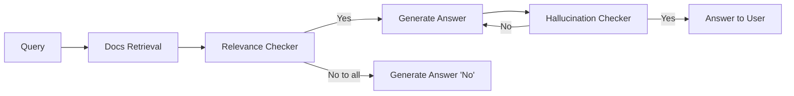

> GenAI / LLM 활용 및 성능 개선

## RAG

1. Docs Retrieval: 사용자 쿼리와 관련된 문서나 정보를 검색
2. Relevance Checker: 검색된 문서 중 가장 관련성 높은 것들을 선별

### Docs Retrieval

사용자의 쿼리와 관련된 문서나 정보를 대규모 데이터베이스나 코퍼스에서 찾아내는 과정이다.

목적:

- 사용자 쿼리와 관련된 가장 적절한 문서들을 신속하게 찾아내는 것
- 후속 처리 단계(예: 관련성 체크, 답변 생성)를 위한 기초 자료 제공

인덱싱, 키워드 매칭, 벡터 공간 모델, 랭킹 알고리즘

### Relevance Checker

검색된 문서나 정보가 사용자의 원래 쿼리와 얼마나 관련이 있는지 평가하는 과정이다.

목적:

- 검색 결과의 품질 향상
- 불필요한 정보 필터링
- 사용자 쿼리에 가장 적합한 정보만을 선별

### Hallucination Checker

